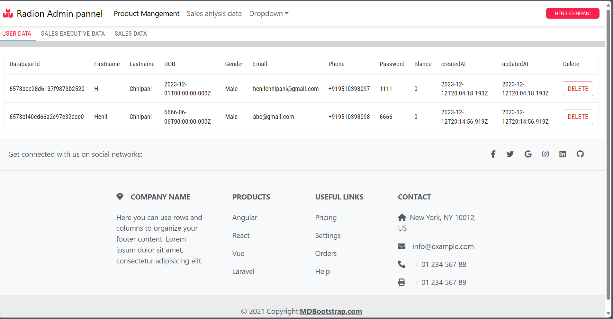

# Radion

Integrated Sales and Customer Management System

## Objective:

The Integrated Sales and Customer Management System aims to streamline and enhance the sales process within a company by providing a comprehensive platform for managing company employees, sales representatives, and customers. The system will include features such as item, Sales employee and customer masters, an intuitive order management process, and detailed reporting capabilities to facilitate data-driven decision-making.

### 1. Customer side app:

This is cutomer side frontend which is showing diffrent product to the cutomer. and cutoner can buy it.

Screnn shot:

- Login App
  
- Singup App
  
- Singup App
  

### 2. Sales Team side app:

This is Sales excutive side frontend. Sales employee can add or remove product. And see analysis of every product sell.

- Sales pannel
  
- Adding Product
  
### 3. Admin side app:

This is Admin side frontend. Admin can restrict the user, Add sales emplee and give the singup and longin access.

- User data
  
- Sales employee data
  

## Technology Stack:

For forntend : React Js and MDB and Material Ui library

For Backenf : Node JS and Expressjs

For Database : MongoDB

For checking backend: Postman 

Git, Github

For Cloud photos : cloudinary

## Runing Fuctinalities :

    Resgistring user and store in MongoDb

    Login with email or phone number

    Add Product (Sales employee)

    Show all products (Customer & sales team)

    Buy a product (Customer)

    Add order details in Order Database

### Still building ............................................
